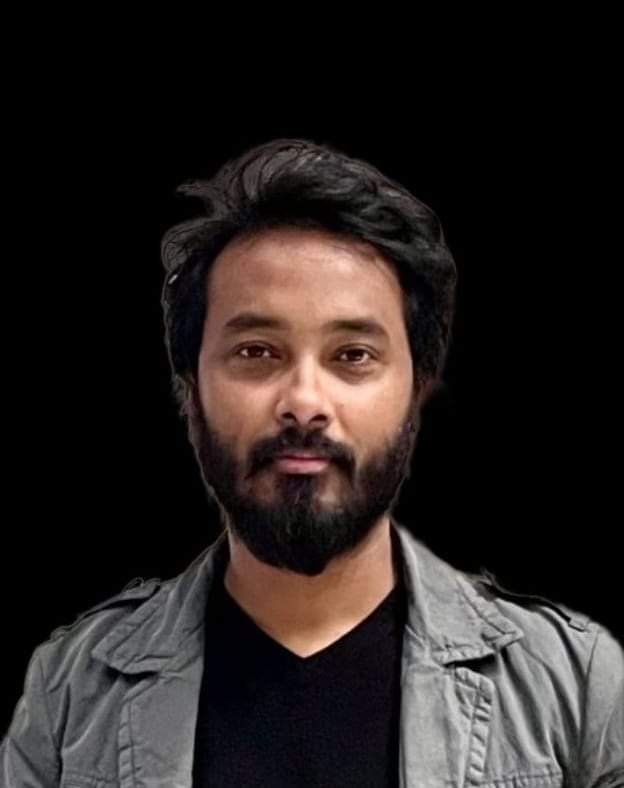

Mohammad-Khan / READMe.md

## 👋 Hello, I'm Mohammad Khan

🏫 A full time mobile and web computing student at Technological Unerversity of Shannon.  
🏠 Living: Limerick, Ireland.

## 👨‍🏫 About me

I'm Mohammad Khan, a BSc Hons student in Mobile and Web Computing at Shannon Technological University, Limerick, Ireland. I completed my Level 5 Software Development course in 2023 and am passionate about becoming a full stack web developer.  
I aim to create seamless and user-friendly digital experiences. I'm dedicated to continuous learning and innovation in the ever-evolving world of web development.

## 👨🏽‍💻My Skills

- HTML5
- CSS3
- JavaScript
- SQL

## 📽 My Recent Project

http://greenhavenlimerick.atspace.cc/

## 👨‍🎓 Education

1. Bachelor of Science in Mobile and Web Computing -(Continuing..)  
   Technical Universityof the Shannon (TUS)   Limerick, Ireland
2. FETAC Level-5 Certificate in software Development  
   Limeick College of Further Education   Limerick, Ireland
3. Certified Accouting Technician(A.C.C.A)  
   Limerick College of Business Studies
     Limerick, Ireland

## 💼Employment History

- Team Leader (March 2016-Sept 2021): Tesco, Limerick, Ireland.

## Certification

- Microsoft Office Specialist: Associate (Office 2019)  
  https://www.credly.com/badges/1b3b1af9-e601-4763-9e60-d4a60f528c44/public_url

## Languages

- Bangla: Native
- English: Advanced
- Hindi: Basic

## Sports

- 🏏Cricket
- ⚽ Football

## Hobbies

- ✈️Travelling
- 📚Reading
- Exploring Techlonology

## Contact

- <a href="mkhan.programming@gmail.com">Email me</a>
